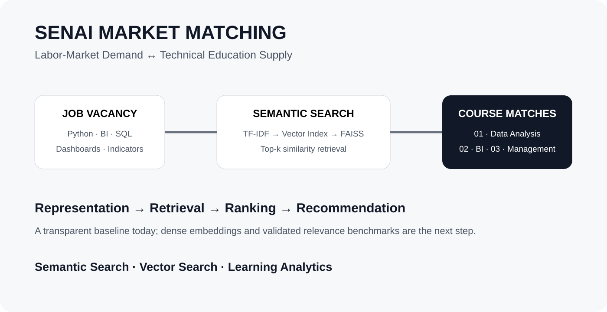
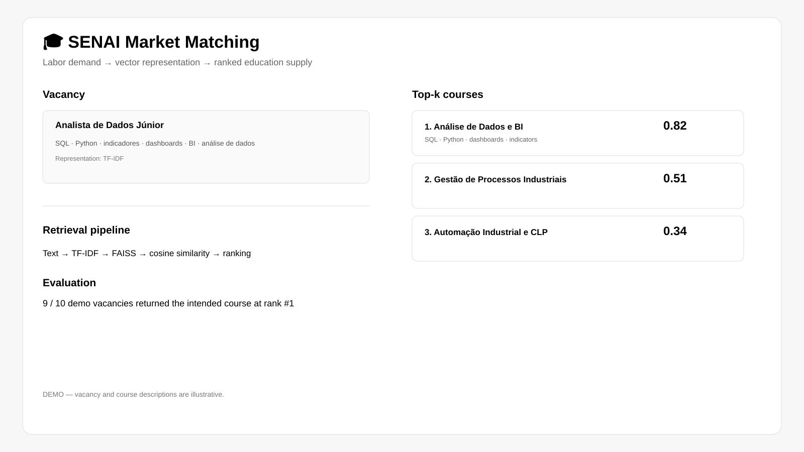
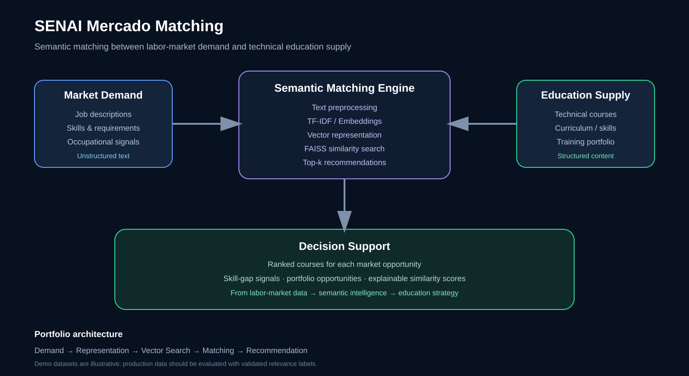

# SENAI Market Matching — Semantic Search for Skills & Courses

> Applied data intelligence system that matches **labor-market demand** with **technical education supply** using text representation, vector search and semantic similarity.

**Portfolio focus:** Semantic Search · Information Retrieval · Vector Search · Machine Learning · Learning Analytics · Decision Support



## Application Demo



> **Demo mode:** synthetic/illustrative data is used where production data or infrastructure is not appropriate for a public portfolio.

Run locally:

```bash
streamlit run demo_app.py
```




---

## Business problem

Labor-market data and education portfolios often describe similar skills using different terminology.

A vacancy may ask for **BI, indicators and dashboards**, while a course curriculum may describe the same capability using different words. Relying only on rigid occupational categories can therefore miss useful relationships between market demand and available training.

This project explores a data-driven alternative: represent vacancy descriptions and course curricula as vectors and retrieve the most similar courses for each market opportunity.

## Solution

The pipeline converts unstructured text into searchable representations and returns the **top-k courses most similar to a vacancy**.

```text
Job description
      ↓
Text preprocessing
      ↓
TF-IDF representation
      ↓
Vector index
      ↓
FAISS similarity search
      ↓
Top-k course matches
      ↓
Market / education decision support
```

The architecture is intentionally designed so the representation layer can evolve from TF-IDF to dense multilingual embeddings without changing the overall retrieval workflow.

## Data transparency

The repository uses **illustrative demo datasets** for both course curricula and job descriptions.

They are not presented as the official SENAI-AL course catalog or as a production extraction of CAGED, Novo CAGED or employment portals.

This distinction is important for a public portfolio: the repository demonstrates the **method and engineering architecture**, while sensitive or restricted production datasets remain outside the public codebase.

## Methodology

### 1. Text preprocessing

Vacancy and curriculum text is normalized and prepared for vector representation, including Portuguese-language preprocessing.

### 2. Vector representation

The current implementation uses **TF-IDF**. This provides a transparent baseline for lexical similarity.

A production-oriented evolution would use multilingual Sentence-BERT or another embedding model to capture semantic relationships between terms that are not lexically identical.

### 3. Vector retrieval

**FAISS** provides the similarity-search infrastructure.

The retrieval layer returns the highest-scoring course candidates for each vacancy.

### 4. Evaluation

On the included demo test set, the current TF-IDF implementation placed the corresponding course first for **9 of 10 test vacancies**.

The remaining error is especially useful analytically: a data analyst vacancy was ranked against an administration course before the intended data-analysis course because the model did not understand the semantic relationship between terms such as **indicators, dashboards and BI**.

That failure is treated as evidence for the next methodological improvement rather than hidden from the portfolio.

## Architecture

| Layer | Technology / approach |
|---|---|
| Input | Job descriptions + course curricula |
| Preprocessing | Python text normalization / Portuguese stopwords |
| Representation | TF-IDF |
| Retrieval | FAISS |
| Ranking | Similarity score + top-k retrieval |
| Interface | Streamlit |
| Future semantic layer | Sentence-BERT / dense embeddings |

## Why this project matters

This project demonstrates a core pattern behind modern **RAG and semantic-search systems**:

```text
Unstructured text
      ↓
Representation
      ↓
Vector index
      ↓
Similarity retrieval
      ↓
Ranked evidence
      ↓
Human decision
```

The same architecture can be extended to:

- course-to-job matching;
- skill-gap analysis;
- curriculum recommendation;
- workforce intelligence;
- RAG retrieval;
- talent and learning analytics;
- market-to-portfolio matching.

## Repository structure

```text
senai-mercado-matching/
├── app/
│   └── streamlit_app.py
├── src/
│   ├── preprocessing.py
│   ├── matching.py
│   └── build_index.py
├── data/
│   ├── courses_senai_demo.py
│   └── vagas_mercado_demo.py
├── models/
├── docs/
│   └── semantic-matching-architecture.svg
├── requirements.txt
└── README.md
```

## Run locally

```bash
python3 -m venv venv
source venv/bin/activate          # Windows: venv\\Scripts\\activate
pip install -r requirements.txt

python src/build_index.py
streamlit run app/streamlit_app.py
```

## Roadmap

- Replace demo data with an authorized production dataset.
- Evaluate retrieval with **Recall@k** and **MRR** using manually validated vacancy-course pairs.
- Replace TF-IDF with multilingual dense embeddings.
- Compare lexical retrieval against semantic retrieval.
- Add explainable matching signals.
- Extend the retrieval layer into a conversational RAG assistant.

## Scope and limitations

The current implementation is a portfolio prototype. The 9/10 demo result should not be interpreted as production model performance. A real deployment would require representative data, a validated relevance benchmark, monitoring and evaluation across occupations, sectors and time periods.

---

**Author:** Wilton Costa  
**Focus:** Data Science · Machine Learning · Applied AI · Learning & Market Analytics
